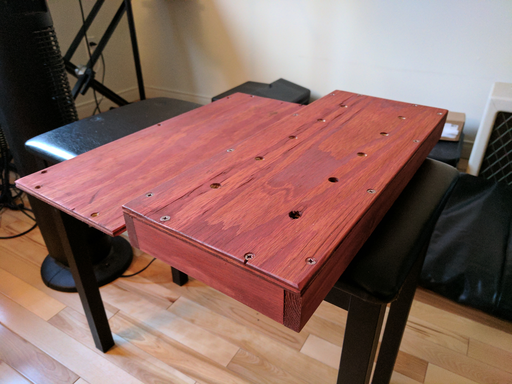
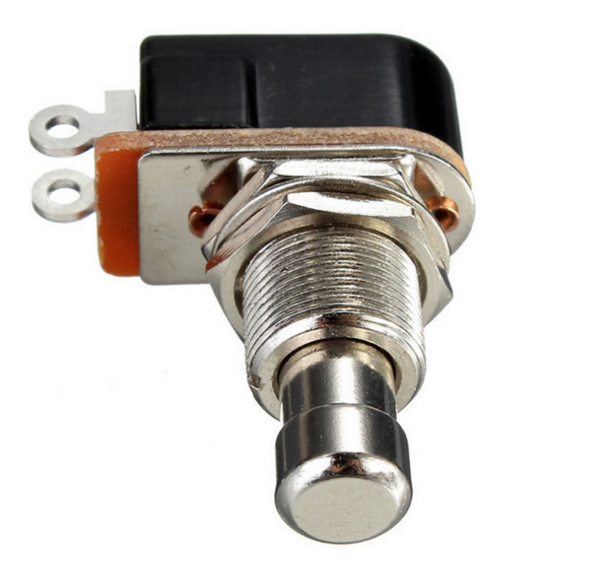
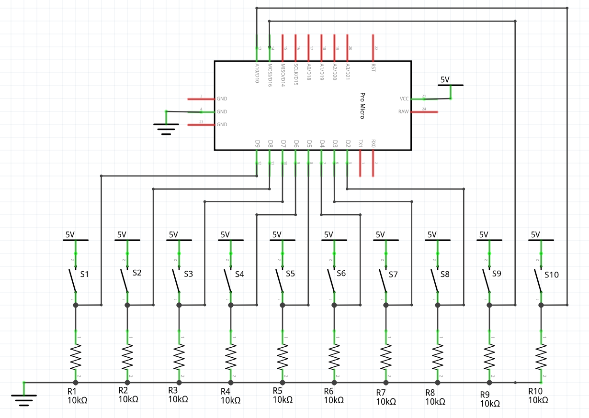
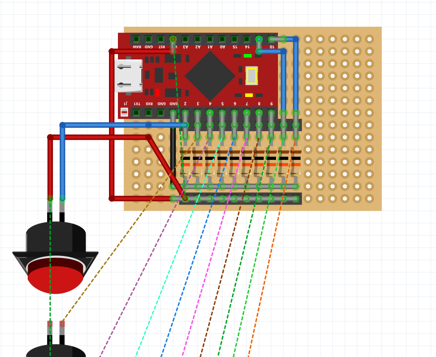
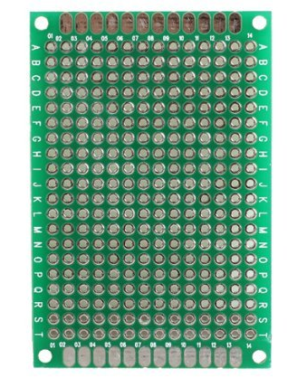
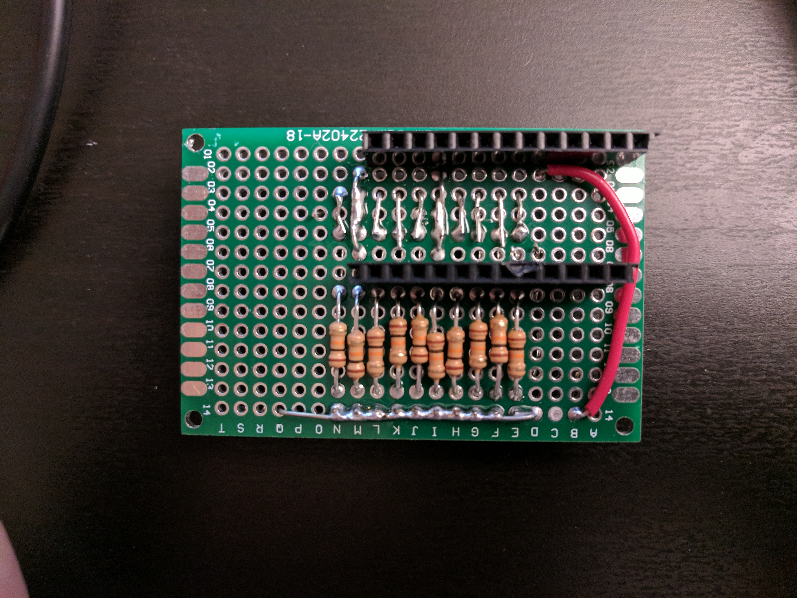
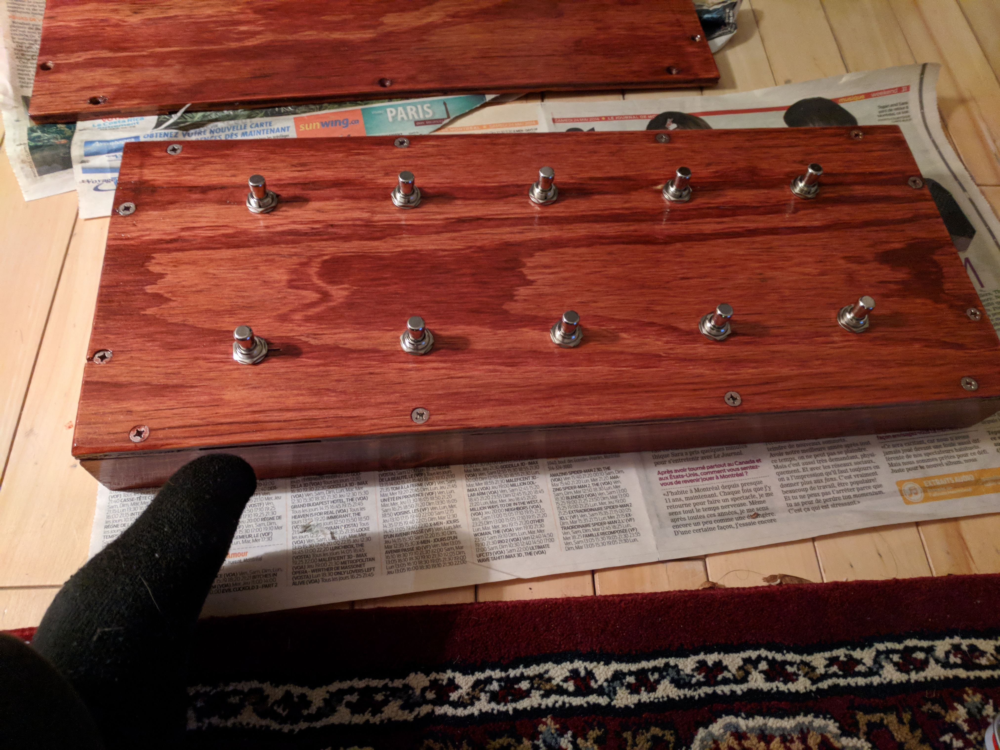
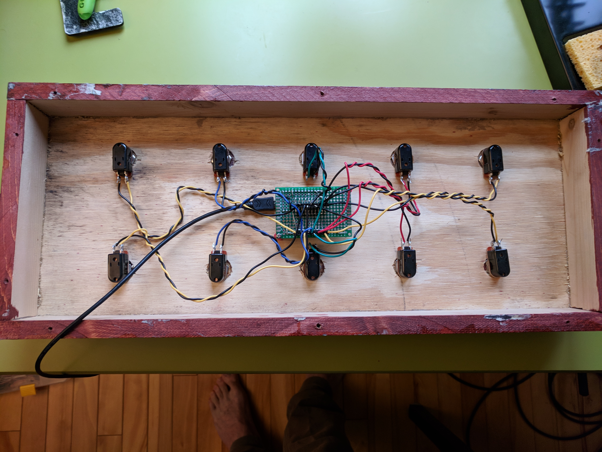

# USB MIDI Controller

Home made foot pedal native USB MIDI controller device using an Arduino pro micro.
The circuit schematics and drawings were made with Fritzing and the code
with the Arduino IDE.

## Context

The goal was to build a footstomp pedal with many switches (10) mostly to control looping software but it can also
be used like any MIDI controller (as a MIDI instrument, to control recording software). The device preferably had to be
recognized as a real MIDI device so I used an Arduino with a ATmega32U4 processor which can be used to emulate a keyboard,
a midi device, etc.

For example, these devices uses the ATmega32U4 processor:

* [Arduino Leonardo](https://store.arduino.cc/usa/arduino-leonardo-with-headers),
* [Arduino Micro](https://store.arduino.cc/usa/arduino-micro)
* [Arduino Pro Micro](https://www.sparkfun.com/products/12640) (SparkFun)
* [Teensy 2.0](https://www.pjrc.com/teensy/)

## Enclosure

Since there are not many enclosures that are big enough to hold 10 foot/stomp switches, I built my own using pieces of wood I
had laying around. I used one sheet for the top, one for the bottom part, and some larger pieces for the sides. I
secured them with glue and screws except for the bottom part which is just screws to be removable.

This is what it looks like once dyed.

I applied 2 layers of varnish to protect the wood:

## Switches

Since I wanted to be able to use the switches as ON/OFF or as pushbuttons, I used simple SPST momentary foot switches.

## Circuit

The circuit is pretty straightforward. The switches are connected from VCC to the 10 Arduino digital inputs
and these inputs are also connected to the ground with pull-down resistors. Even though I believe the Arduino
has internal pull-up resistors that can be actived through software, having actual pull-down resistors is a bit safer
and helped for solder the components to each other.

On the [protoboard](), it looks like this:

I used female headers to prevent having to solder the wires and the Arduino directly on the protoboard to be able to
reuse the arduino or the switches without desoldering. Since 
the [protoboard I used](https://www.amazon.ca/gp/product/B00KNN21Z6/ref=oh_aui_detailpage_o03_s00?ie=UTF8&psc=1)
did not have any prior connections, the connections were made directly with the resistor legs.

The protoboard looks like this:

Here is the soldered back of the circuit board:

Here is the soldered front of the circuit board:

Note: I realized after soldering that I forgot to solder the bottom female header and that I had planned the Arduino inputs
upside down so I had to be a little creative. I soldered the input headers on the opposite side and switched the ground
and the VCC of the arduino (I was lucky since the Arduino inputs are pretty symmetric). In the end the pull-down resistors
just became pull-up resistors.

## Assembly

This is what the box looks like with switches on it.

I soldered cables to the switches and just inserted the other ends of the cable in their respective ground and input
female header slot on the board. Note: one can use hot glue to make sure that the cables stay still in the female headers
on the board. I used a male to female micro-USB cable to expose the Arduino micro-USB port and have a longer USB cable Here is what is looks like:

## Code

I basically just reused this [MIDI device example](https://www.arduino.cc/en/Tutorial/MidiDevice) and adapted
the code for 10 inputs. An important difference here is that I changed the `pressedButtons` and `previousButtons` bit flag 
variables to `uint16_t`. A uint8_t was adequate for up to 8 inputs but I used 10 inputs which had not enough bits to handle
10 inputs.

